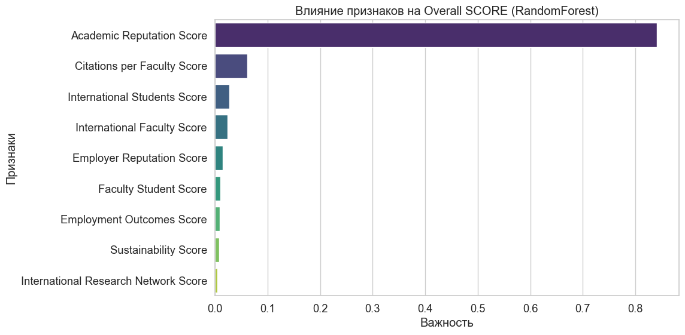
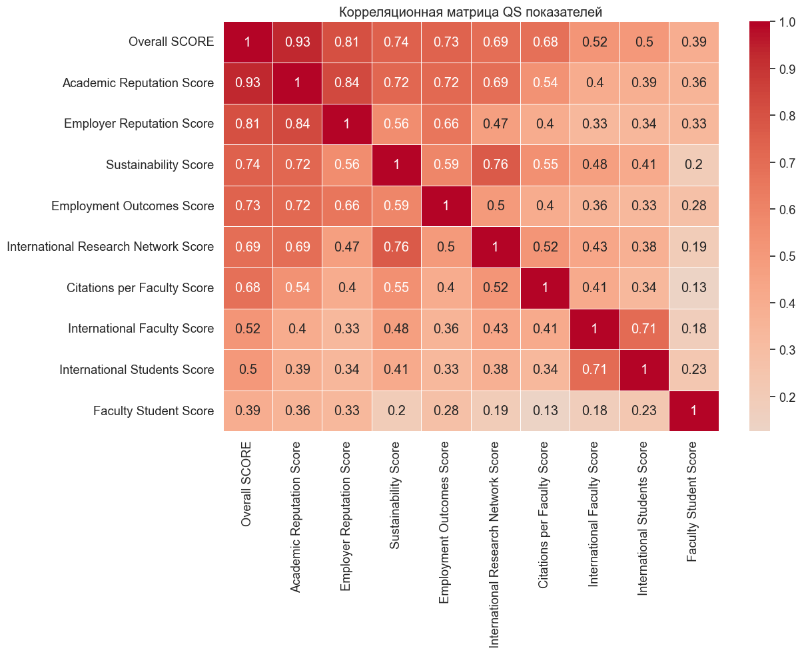
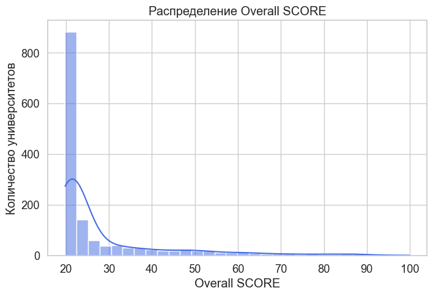

# QS University Rankings 2024: Analysis

Analysis of the QS World University Rankings 2024 to determine which factors matter most for university rankings.

## 📊 Visualizations

### Feature impact on ranking

### Correlation between metrics

### Overall Score distribution

## Key Results

- Recovered missing Overall Score values with R² = 0.997 accuracy
- Found that Academic Reputation is the main ranking driver (correlation: 0.93)
- Developed recommendations for universities at different ranking levels

## Technologies

Python, pandas, scikit-learn, matplotlib, seaborn

## How to Run

1. Download the .ipynb file
2. Open it in Jupyter Notebook
3. Run all cells
